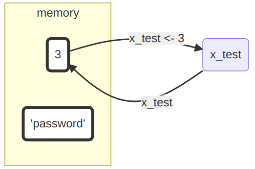
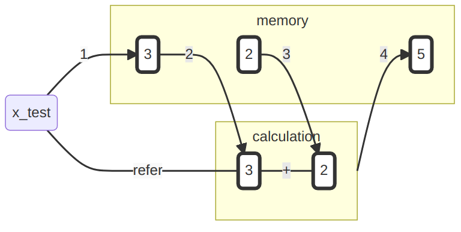
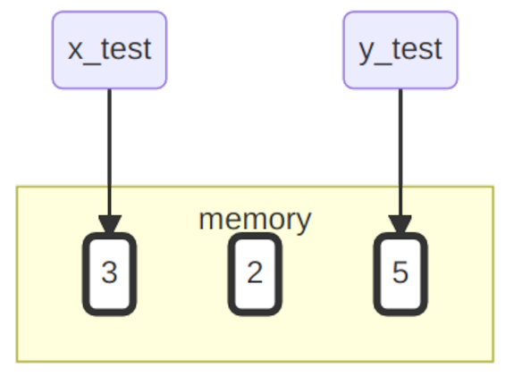
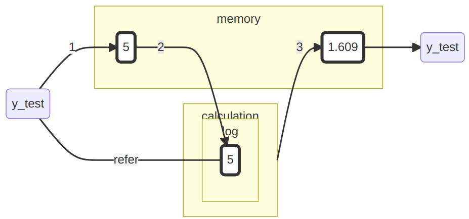
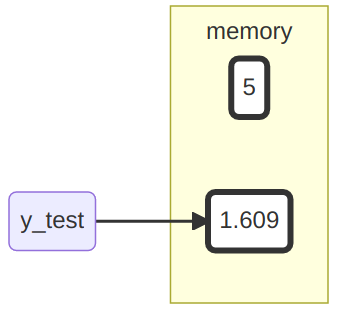

```{r, include=FALSE}
knitr::opts_chunk$set(echo = TRUE, cache = FALSE)
```


# Atomare Datentypen 

Datentypen sind die Grundlage einer jeder Programmiersprache und somit essenziell zum Verständnis dieser. Sie dienen dazu, verschiedene Typen unterscheiden. Etwa Zahlen von Buchstaben. Das ist besonders wichtig, da wir mit unterschiedlichen 'Typen' unterschiedliche Operationen ausführen, bzw. nicht ausführen, können. Zum Beispiel können wir mit Zahlen rechnen, mit Buchstaben hingegen nicht. Mit logischen Bedingungen können wir wiederum Wahrheitswerte ermitteln, mit Zahlen hingegen nicht. Zu wissen, welche Eigenschaften die verschiedene Datentypen haben und welche Operationen mit diesen möglich sind, hilft dabei vielen potenziellen Fehlern vorzubeugen und so Frustration zu vermeiden. 


Zunächst einmal wollen wir uns die atomaren Datentypen anschauen. Diese bilden die Grundlage aller folgenden Datentypen.

Datentyp              Beschreibung                            Beispiel 
-------------------   -------------------------------------  ----------
integer               ganze Zahlen                            -2L       
numeric               reelle Zahlen                           5.2456   
logic                 logische Werte                          TRUE     
character             Zeichenfolge                           "Mexico" 
NA,NULL,NaN           Unbestimmt, Leer, Undefiniert                    
Inf                   Unendlich                                        

Die numerischen Datentypen `integer` und `numeric` erlauben es uns numerische Informationen zu repräsentieren. Mit dem Datentyp `logic` können wir logische Informationen repräsentieren. Um symbolische Informationen zu repräsentieren, verwenden wir den Datentyp `character`. Mit numerischen-, logischen- und symbolischen Informationen ist es bereits möglich eine Vielzahl von Sachverhalten auszudrücken. Was dies sein kann, wollen wir uns im Folgenden anschauen.

## Arithmetische Grundoperationen und Basisfunktionen

R beherscht für alle  Zahlen die arithmetischen Grundoperationen und eignet sich somit wunderbar als Taschenrechner.

  Operation     Beschreibung                          Beispiel  
  ----------    --------------------------            ---------
  `+,-`         Addition, Subtraktion                 `3-1.2` 
  `*,/`         Multiplikation, Division              `4.8/4`
  `^`           Potenz                                `5^2`
 
Beispiel:
```{r}
1+2

2*3.5

10.1^3

```

 
R vefügt für den Datentypen `numeric` über viele elementare Grundfunktionen.
 Hier nur ein paar wenige relevante Beispiele:
 
  Operation         Beschreibung                           Beispiel  
  --------------    -------------------------------------- ---------
  `sqrt()`          Quadratwurzel                          `sqrt(9)`
  `abs()`           Absolutbetrag                          `abs(-12)`
  `log(),exp()`     Logarithmus und Expontentialfunktion   `exp(3)`
  `round()`         Runden                                 `round(2.12)`
 
```{r}
sqrt(5)
log(3)
```

### Funktionsaufrufe  

Funktionen sind ein wichtiger Teil von R und werden syntaktisch durch eine öffnende und eine schließende Klammer gekennzeichnet, nach diesem Schema: `funktion()`. Gerade haben wir bereits eine Funktion ausgeführt, indem wir `sqrt(9)` aufgerufen haben. Ausführlich werden Funktionen noch in Kapitel 3 besprochen. Ein paar Grundlagen wollen wir hier aber schon einmal einführen:

Funktionensaufrufe erfolgen in der Regel über das Schema
 
`Funktionsname(Argument 1, Argument 2, ...)`
 
Beispiel: Die Funktion

`signif(x,digits)`
 
rundet eine Zahl `x` auf `digits` signifikante Stellen.
 
1.  Argumente haben zumeist einen festen Namen, sodass diesen eindeutig Werte 
    zugewiesen werden können:
 
```{r}
  signif(x = 12.3456, digits = 3)
```
  
 
2. Alternativ können aufgrund der Position bzw. der Ordnung den Argumenten Werte zugewiesen werden: 

```{r}
  signif(12.3456, 3)
```


### Was wir bisher getan haben

“To understand computations in R, two slogans are helpful: Everything that exists is an object. Everything that happens is a function call.”  (John M. Chambers) [^1]

[^1]: https://de.wikipedia.org/wiki/R_%28Programmiersprache%29

\bigskip

  - bis jetzt haben wir uns nur Funktionen angeschaut
  - die Ergebnisse der Funktionen sind alle flüchtig und "existieren" somit nicht, da diese nicht an ein Objekt gebunden sind

```{r, echo=FALSE, out.width='20%', fig.align='center'}
knitr::include_graphics("resources/1_pure_memory.png")
```

Geben wir etwa die Zahl `3` oder die Zeichenkette `"password"` in die Konsole ein, bekommen wir dieselben Werte zurück. Diese wurden somit im Speicher angelegt. Allerdings können wir auf die Werte nicht mehr zugreifen. Wenn wir zum Beispiel erneut die Zeichenkette `"password"` benötigten, müssten wir sie erneut eintippen. Auf die bereits im Speicher existierende haben wir keinen Zugriff. Wie wir das ändern können und für uns 'existierende' Objekte erzeugen können, wollen wir uns nun anschauen.

## Erzeugung von Objekten

Mit dem  Operator `<-` lässt sich ein Objekt erstellen, welche aus einem Namen (`x_test`) und einem Wert (`3`) besteht:


```{r}
 x_test <- 3
```

Der Wert dieses Objekts lässt sich über den Namen aus dem Speicher abrufen:

```{r}
x_test
```

Wenn wir 

```{r}
 x_test <- 3
```

ausführen, passiert formal eigentlich Folgendes:

1.  Es wird im Speicher ein Objekt mit Wert 3 erzeugt.
2.  Es wird der Name `x_test` an dieses Objekt gebunden, sodass zu diesen Objekt
    mit dem Namen `x_test` referiert werden kann bzw. bei Aufruf von `x_test` 
    der Wert zurückgegeben wird.

```{r, echo=FALSE, out.width='55%', fig.align='center'}

```

Über den Namen unseren neues Objektes können wir nun dauerhaft dessen Wert (`3`) abrufen.

### Anmerkung Namen

Für Namen dürfen alle Buchstaben und Zahlen verwendet werden, sowie 
die beiden Sonderzeichen `_` und `.`, wobei diese nicht
am Anfang stehen dürfen. 

Beispiel:

```{r}
x_1 <- 3
```

Aber:

```{r, message = TRUE, error = TRUE}
_x_1 <- 3
```

**Bemerkung:** Man sollte sich bei den Buchstaben nur auf a,...,z bzw. A,.., Z beschränken, auch wenn je nach lokalem Setting z.B. auch andere Buchstaben wie ä zulässig sind.

### Rechnungen mit Werten von Objekten
 
Befindet sich das Objekt im Speicher, so steht es für alle weiteren 
Berechnungen und Operationen zur Verfügung:

```{r}
x_test + 2
```

```{r, echo=FALSE, out.width='70%', fig.align='center'}

```

Das Ergebnis bzw. der Wert eines solchen Ausdrucks lässt sich aber auch für 
spätere Zwecke einem neuen Objekt zuordnen:

```{r}
y_test <- x_test + 2

y_test
```

```{r, echo=FALSE, out.width='80%', fig.align='center'}
knitr::include_graphics("resources/4_calculation_with_assignmend.png")
```


Unser Speicher sieht aktuell so aus:
\vspace{1cm}

```{r, echo=FALSE, out.width='40%', fig.align='center'}

```

Zwar haben wir für die Berechnung auch eine Zwei im Speicher angelegt, diese ist aber nicht an ein Objekt gebunden. Die Drei und die Fünf hingegen schon. Wenn wir nun `x_test` und `y_test` aufrufen, bekommen wir jeweils den entsprechenden Wert zurück.

### Objekte überschreiben
 
ACHTUNG! - Verwendet man den selben Objektnamen nocheinmal, geht die ursprüngliche Referenz verloren:

```{r}
y_test <- log(y_test)
```

```{r, echo=FALSE, out.width='70%', fig.align='center'}

```


Wenn wir jetzt den Wert des Objekts `y_test` abfragen sehen wir folgendes: 
```{r}
y_test
```

Der ursprüngliche Wert des Objektes namens `y_test` steht uns nicht mehr zur Verfügung und somit unwiederbringlich verloren.

```{r, echo=FALSE, out.width='30%', fig.align='center'}

```

Führt man die Codezeile `y_test <- log(y_test)` jetzt noch einmal aus, so wird `y_test` wieder ein anderer Wert zugewiesen. Durch dieses Verhalten können wir nie sicher vorhersagen, welchen Wert `y_test` momentan hat. Deswegen sollte man immer neue Objektnamen vergeben und diese nicht doppelt verwenden.


### Objekte löschen

 Wir haben mittlerweile eine Menge Objekte im Speicher
 angelegt. Mit `ls()` kann man diese abrufen:

```{r}
ls()
```


Mit `rm()` kann man unnötige Objekte entfernen:

```{r}
rm(y_test)
```


Wenn ihr gleich alle angelegten Objekte aus dem Arbeitsspeicher entfernen wollt:
 
```{r}
rm(list = ls())
```
 
 
## Logische Werte und Operationen

Die Werte Wahr und Falsch werden in R mit `TRUE` und `FALSE` repräsentiert. 
Es stehen die elementaren Boolschen Operationen zur Verfügung.

  Operator  | Bedeutung 
  --------- | --------- 
     `!`    | Negation   
     `&`    | Und       
     `|`    | Oder      
       
 
```{r}
p <- TRUE
!p

q <- FALSE

(p | q)
```
 
 
### Der "logische" Wert NA

Neben Wahr und Falsch existiert noch die logische Konstante `NA`, welche
für einen unbestimmten aber bestimmbaren Wert steht (not assigned, not available 
yet). 

Dieser Wert wird z. B. universell für alle atomaren Datentypen für die Codierung 
von Fehlwerten (missings) verwendet.


```{r}
theendoftheworld <- NA
```


### Vergleichs-Operationen
 
Logische Werte spielen in R an verschiedenen Stellen eine große Rolle, 
da sie z.B. beschreiben, ob bestimmte Vergleiche wahr oder falsch sind.
   
  Operator  | Bedeutung 
  --------- | -----------------
  `==`      | Gleich?   
  `!=`      | Ungleich?      
  `> / <`   | Größer / Kleiner?     
  `>= / <=` | Größer / Kleiner gleich?

```{r}
alter_tom <- 21
alter_moni <- 24
alter_tom > alter_moni
```


## Zeichen (character)

Neben Zahlen und logischen Werten, werden wir auch 
Zeichenketten begegnen bzw. benötigen. Diese können auf
zweierlei Art zugewiesen werden:
```{r}
"Tom"
'Moni'
```


```{r}
name_bundeskanzler <- "Olaf Scholz"
name_bundeskanzler
```


## Klasse eines Datenobjektes
 
Zur Erinnerung:
 
Datentyp             | Beschreibung             | Beispiel
----------           | ----------------         | :-----------------------:
integer              | ganze Zahlen             | -2L
numeric              | reelle Zahlen            | 5.2456   
logic                | logische Werte           | TRUE
character            | Zeichengfolge            | "Mexico" 
NULL,Inf,NaN         | Leer, Unendlich, keine Zahl |

Die Klasse bzw. der Datentyp eines Objekts lässt sich 
mit der Funktion `class()` ermitteln oder aber spezifisch/logisch prüfen.

```{r}
class(alter_moni)
is.numeric(alter_moni)
```


## Spezielle Werte

 Die leere Menge wird in R mit dem Wert `NULL` repräsentiert und dient ganz verschiedenen Zwecken wie z.B. Initialisierung einer Variablen:
 
```{r}
   z <- NULL
   z
```


 Division durch 0 ist "erlaubt" und liefert den speziellen Wert 
 `Inf` zurück.
 
```{r}
  100/0 
```
  

 In R wird ein nicht bestimmbarer Wert (vgl. unbestimmter aber bestimmbarer
 Wert 'NA') durch `NaN` (not a number)
  0/0

## Prüfe dich selbst

Von dieser Sitzung solltest du folgendes mitgenommen haben: 

- [x] du solltest verstanden haben, warum man verschiedene Datentypen unterscheidet
- [x] du solltest die drei Grundlegenden weisen Informationen zu repräsentieren nennen können und die dazugehörigen Datentypen
- [x] du solltest verstanden haben wie man ein Objekt anlegt und wozu das nützlich sein könnte
- [x] du solltest die elementaren Boolschen (logische) Operationen in R schreiben können
