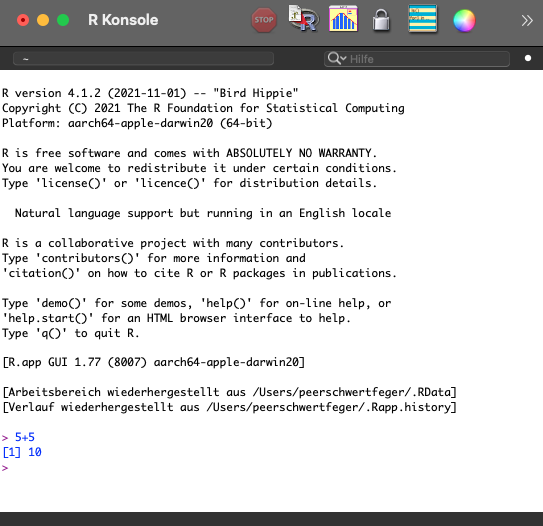

--- 
title: "Handout für R Grundkurs"
author: |
  | Peter Kannewitz 
  | peter.kannewitz@uni-leipzig.de
  |
  | Peer Schwertfeger
  | peer.schwertfeger@uni-leipzig.de
subtitle: "URZ und Academic Lab Universität Leipzig"
date: "Stand: `r Sys.Date()`"
site: bookdown::bookdown_site
---

# Vorwort {-}

Dieses Handout ist Teil des Grundkurses in R am URZ und am Academic Lab der Uni Leipzig.

Besonderem Dank gilt Stephan Poppe und dem Statistik-Team des Instituts für Soziologie
für die Unterstützung beim Erstellen der Materialien für diesen Kurs.


```{r, echo=FALSE, out.width='30%', fig.align='center'}

```

**Hinweis**:

Dieses Handout ist ständig in Bearbeitung und erhebt keinen Anspruch auf Vollständigkeit. Bitte informiert uns,
sollten Angaben nicht mehr aktuell sein bzw. sollten sich Fehler eingeschlichen haben. Vielen Dank!

# Hinweise zur Verwendung des Handouts {-}

- In den einzelnen Kapiteln wird immer wieder R Code ausgeführt. Dabei wird immer im ersten Block der jeweilige Ausdruck angegeben und im zweiten das dazugehörige Ergebnis, was wie folgt aussieht:

```{r}
1+1
``` 

- Am Ende eines jeden Kapitels gibt es eine kleine Checkliste, welche als "Prüfe dich selbst" überschrieben ist. Anhand dieser könnt ihr euch testen, ob ihr allem folgen konntet und die Sachverhalte verinnerlicht habt. Wenn nicht, habt ihr dann vielleicht einen Anhaltspunkt, was ihr später vielleicht noch einmal nachlesen könntet.

- Es empfiehlt sich über die Menüleiste oben die Anzeigeeinstellungen (A) zu ändern. Wenn ihr Mal ein Kapitel durcharbeiten wollt, ist eine Schriftart mit Serifen und ein etwas dunkler Hintergrund vielleicht angenehmer. Also probiert das gerne mal aus!

- Das gesamte Handout ist über GitHub Pages veröffentlicht. Wenn ihr einen Fehler entdeckt oder Anmerkungen habt, dann zögert nicht ein Issue auf zu machen und Änderungen vorzuschlagen! Über das Auge oben in der Menüleiste kommt ihr zum Repository.

# Einführung

```{r, echo=FALSE, out.width='30%', fig.align='center', fig.cap="R Logo (https://www.r-project.org/logo/)"}
knitr::include_graphics("resources/R_logo.png")
```

## Was ist R und warum sollte man R lernen?

R ist eine freie Programmiersprache, die in erster Linie für statistische Analysen konzipiert wurde. Durch ihre große Community (siehe [Stack Overflow](https://stackoverflow.com/questions) oder [RBlogger](https://www.r-bloggers.com)) und ihre ständige Weiterentwicklung durch sogenannte *Packages*, ist der Funktionsumfang von R praktisch unbegrenzt.

Neben den *klassischen* Funktionen statistischer Software (Datenaufbereitung, Analysen, Graphikerstellung) sind z.B. folgende Anwendungen möglich:

- Erstellen von Präsentationen und Papern (mit RMarkdown)
- Webscraping
- Qualitative Textanalyse
- Auslesen von Datenbanken
- Automatisierungen
- uvm.

Zum Teil durch die vielfältigen Anwendungsmöglichkeiten hat sich bzw. entwickelt sich
R zum Goldstandard in der akademischen Welt und in vielen Bereichen der Wirtschaft[^1].

[^1]: https://analyticsindiamag.com/has-python-completely-edged-out-r-in-data-science-field/

Wie auch bei Sprachen, lernt man Programmiersprachen nicht (nur) durch Kurse. Eine Aktive Auseinandersetzung mit konkreten Problemen hilft, "fließender" im Umgang mit der Sprache zu werden. Kommt man einmal nicht weiter (wird passieren... versprochen!), hilft es, sich solange mit dem Thema zu beschäftigen, bis eine Lösung gefunden wurde. 

Warum sollte man das auf sich nehmen?

**6 Gründe, R zu lernen**:

1. *Open Source* und plattformübergreifend
2. Praktisch unbegrenzter Funktionsumfang
3. Entwickelt sich zum Standard in akademischer Welt und in der Wirtschaft
4. Publizierfähige Graphiken
5. Integration von Aufbereitung, Analyse und Präsentation
6. Internationale Community ([Stack Overflow](https://stackoverflow.com/questions/tagged/r), [RBloggers](https://www.r-bloggers.com) etc.)

## Installation 

Zunächst muss unser Computer R "lernen".

Um R zu installieren, gehe auf die entsprechende [Cran Website](https://cran.r-project.org). Wähle dein Betriebssystem aus und folge 
den Anweisungen auf der Website.

Um produktiv zu arbeiten, sollte zusätzlich die open source-Vesion von RStudio 
installiert werden. Weitere Infos hierzu gibt es [hier](https://www.rstudio.com).

# Oberfläche

## R GUI

Mit der Installation von R wird gleichzeitig ein *Graphical User Interface* (GUI)
mitinstalliert. Hier können wir bereits R Code eingeben und mit `Enter` an den 
Computer übergeben. In der nächsten Zeile wird die Antwort vom Computer an uns
zurückgegeben.

```{r, echo=FALSE, out.width='80%', fig.align='center', fig.cap="R GUI"}

```

Diese Oberfläche ist jedoch wenig "komfortabel". Sie bietet keine zusätzlichen Editoren oder Fenster, um z.B. die gespeicherten Objekte oder Graphiken anzuzeigen.

## RStudio

```{r, echo=FALSE, out.width='60%', fig.align='center', fig.cap="RStudio Logo (https://www.rstudio.com/about/logos/)"}
knitr::include_graphics("resources/RStudio.png")
```

```{r, echo=FALSE, out.width='80%', fig.align='center', fig.cap="RStudio Interface"}
knitr::include_graphics("resources/interface.png")
```

RStudio bietet eine nutzer:innenfreundliche (und freie) Alternative für die Nutzung von R. Hier sind zusätzliche Editoren und Übersichten enthalten. Zu nennen ist beispielsweise:

- Script-Editor
- Übersicht über Objekte in globaler Umgebung 
- Übersicht über Packages
- Einfache Dateienhandhabung durch Projects 
- u.v.m. 

Das Interface von RStudio besteht aus mehreren Fenstern.

### Console

```{r, echo=FALSE, out.width='80%', fig.align='center', fig.cap="Console"}
knitr::include_graphics("resources/console.png")
```

Die R Console dient zur direkten Übergabe von Ausdrücken bzw. Funktionen an R 
und ist identisch mit der Anzeige in der R GUI. Diese eignet sich für für 
kleine Tasks bzw. Tests. Das Ergebnis wird direkt unterhalb des Befehls angezeigt.
Außerderm werden Ergebnisse aus den Scripten, die keine Graphiken sind, 
hier angezeigt.

Nachdem Code hier eingetippt wurde, wird die Befehlszeile mit der Taste
`ENTER` ausgeführt.


### Script Editor

```{r, echo=FALSE, out.width='80%', fig.align='center'}
knitr::include_graphics("resources/editor.png")
```

In der Console kann euer Code langfristig nicht gespeichert werden. Sogenannte R
Scripte ermöglichen euch, euren Code zu speichern und nacheinander auszuführen.

Der entsprechende Editor muss zunächst händisch geöffnet werden:

`File` $\rightarrow$ `New File` $\rightarrow$ `R Script`

Nachdem Code geschrieben wurde, kann der Code mit folgender Tastenkombination 
ausgeführt werden:

`strg + ENTER` (Win) bzw. `command + ENTER` (Mac)

Hierzu genügt es, wenn sich der Cursor in **einer** der Zeilen der Befehlssequenz
befindet. Sollen mehrere Befehlssequenzen ausgeführt werden, müssen diese vorher
markiert werden.

Mit `#` lassen sich Kommentare in das Script schreiben. Zeilen, in denen dieses 
Zeichen steht, werden von R ignoriert und nicht ausgeführt.

### File-Editor und Environment

```{r editor, echo=FALSE,out.width="49%", out.height="20%",fig.cap="File-Editor und Environment-Oberfläche",fig.show='hold',fig.align='center'}
knitr::include_graphics(c("resources/files.png","resources/envi.png"))
```

Zusätzlich zu der Console und dem Skript-Editor bietet RStudio weitere Fenster,
die die Arbeit mit R vereinfachen sollen.

Das Fenster unten rechts (Standardeinstellung, Abbildung \@ref(fig:editor)a) beinhaltet einen **File-Editor** 
(ähnlich zum File Browser (Win) bzw. Finder (Mac)). Hier können Dateien und 
Verzeichnisstrukturen angesehen und bearbeitet werden (neuer Ordner, Umbenennen
von Dateien). Außerdem werden hier **Graphiken angezeigt**, wenn diese über Code in
Scripten oder in der Console erzeugt werden. Des Weiteren gibt es hier eine 
**Übersicht über Packages** und das **Help** Fenster.

Oben rechts (Standardeinstellung, Abbildung \@ref(fig:editor)b) existiert die **Global Environment**, in dem 
alle gespeicherten Objekte angezeigt werden. Schließlich kann man hier auf die 
**History** und **Verbindungen**, wie GitHub, zugegriffen werden.

## Prüfe dich selbst

Von dieser Sitzung solltest du folgendes mitgenommen haben: 

- [x] Du solltest die Wesentliche Funktionsweise von R verstanden haben.
- [x] Du solltest den Aufbau von RStudio kennen.
- [x] Du solltest wissen, was ein Script ist und wie es geöffnet werden kann.
- [x] Du solltest wissen, wie Befehlssequenzen in der Console und in einem Script ausgeführt werden.

